# Meta Pixel Metrics Flow Diagram


## Event Flow Sequence


## Metrics Data Flow


## Key Metrics Explained

### 1. **Conversion Events**
- `CompleteRegistration`: Standard Meta event for registrations
- `Lead`: Standard Meta event for lead generation
- Both count as conversions in your metrics

### 2. **Conversion Value**
- Value: $40.00 per registration (calculated as: $200 service × 20% conversion rate)
- Currency: USD
- Used for ROAS (Return on Ad Spend) calculations

### 3. **Attribution Windows**
- **1-day view**: User saw ad, didn't click, converted within 1 day
- **7-day click**: User clicked ad, converted within 7 days
- **28-day click**: Extended attribution window

### 4. **Where Metrics Appear**
- **Events Manager**: Real-time event tracking
- **Ads Manager**: Campaign performance metrics
- **Analytics**: Detailed conversion reports
- **Attribution**: Which ads/channels drove conversions

---

## What Changed: Test Events vs Real Events

### Before (With Test Event Code)


**With `test_event_code: 'TEST73273'`:**
- ❌ Events appear in Events Manager but marked as "TEST"
- ❌ **Do NOT count** toward conversion metrics
- ❌ **Do NOT** affect campaign optimization
- ❌ **Do NOT** attribute to ad campaigns
- ❌ **Do NOT** count toward ROAS calculations
- ✅ Only useful for debugging/verification

### After (Without Test Event Code)

```mermaid
graph LR
    A[Form Submission] --> B[Event WITHOUT test_event_code]
    B --> C[Events Manager<br/>Shows as LIVE]
    B --> D[Ads Manager<br/>COUNTED in conversions]
    B --> E[Campaign Optimization<br/>USED for learning]
    B --> F[Attribution<br/>ATTRIBUTED to ads]
    B --> G[ROAS Calculation<br/>$199 × conversions]
    
    style C fill:#d4edda
    style D fill:#d4edda
    style E fill:#d4edda
    style F fill:#d4edda
    style G fill:#d4edda
```



**Without test event code:**
- ✅ Events appear in Events Manager as **LIVE** events
- ✅ **COUNT** toward conversion metrics
- ✅ **AFFECT** campaign optimization (Meta learns from them)
- ✅ **ATTRIBUTE** to ad campaigns (you'll see which ads drove conversions)
- ✅ **COUNT** toward ROAS calculations
- ✅ **ENABLE** custom audiences based on conversions
- ✅ **ENABLE** lookalike audiences from converters

---

## What Happens Now

### 1. **Real Conversion Tracking**

Every form submission now counts as a **real conversion**:


### 2. **Campaign Optimization**

Meta's algorithm will now:
- **Learn** from your conversions
- **Optimize** ad delivery toward people likely to convert
- **Adjust** bidding to maximize conversions
- **Improve** campaign performance over time

### 3. **Attribution & Reporting**

You'll now see:
- **Which ads** drove each conversion
- **Which campaigns** are performing best
- **Attribution windows**: 1-day view, 7-day click, 28-day click
- **Conversion paths**: How users interacted before converting

### 4. **Audience Building**

You can now create:
- **Custom Audiences**: People who completed registration
- **Lookalike Audiences**: Similar to your converters
- **Retargeting**: Target people who started but didn't complete

### 5. **ROAS & Value Tracking**

- **Conversion Value**: $40.00 × number of conversions
- **ROAS**: Revenue ($199 × conversions) / Ad Spend
- **CPA**: Ad Spend / Number of Conversions
- **Value-based optimization**: Optimize for highest value conversions

---

## How to Verify It's Working

### 1. **Events Manager** (Real-time)
1. Go to [Meta Events Manager](https://business.facebook.com/events_manager2)
2. Select your Pixel (ID: 1375484534303889)
3. Click "Test Events" tab → Should show **no test events** (or old ones)
4. Click "Overview" tab → Should show **LIVE events** after form submission
5. Events should show as **"CompleteRegistration"** and **"Lead"** (not TEST)

### 2. **Ads Manager** (After 24-48 hours)
1. Go to [Meta Ads Manager](https://business.facebook.com/adsmanager)
2. Check your campaigns
3. Look for **Conversions** column
4. Should show conversion count and value ($40 × count)

### 3. **Browser Console** (Immediate)
1. Open browser DevTools (F12)
2. Submit a test form
3. Look for console log: `"Meta Pixel events tracked:"`
4. Should show event parameters without `test_event_code`

### 4. **Meta Pixel Helper** (Chrome Extension)
1. Install [Meta Pixel Helper](https://chrome.google.com/webstore/detail/meta-pixel-helper/fdgfkebogiimcoedlicjlajpkdmockpc)
2. Visit your registration page
3. Submit a form
4. Click the extension icon
5. Should show events as **"LIVE"** (not TEST)

---

## Timeline of Changes

```mermaid
gantt
    title Event Processing Timeline
    dateFormat X
    axisFormat %s
    
    section Immediate
    Event Fired           :0, 1s
    Browser Console Log   :1s, 1s
    
    section Real-time
    Events Manager        :2s, 5m
    
    section 24-48 Hours
    Ads Manager Metrics   :1d, 1d
    Attribution Updated   :1d, 1d
    
    section Ongoing
    Campaign Optimization :2d, 30d
    Audience Building     :2d, 30d
```

- **Immediate (0-5 min)**: Events appear in Events Manager
- **24-48 hours**: Metrics appear in Ads Manager, attribution updates
- **Ongoing**: Campaign optimization improves, audiences build

---

## Key Differences Summary

| Feature | With Test Code | Without Test Code (Now) |
|---------|---------------|------------------------|
| **Events Manager** | Shows as TEST | Shows as LIVE ✅ |
| **Conversion Count** | ❌ Not counted | ✅ Counted |
| **Conversion Value** | ❌ Not tracked | ✅ $199 × count |
| **Campaign Optimization** | ❌ Not used | ✅ Used for learning |
| **Attribution** | ❌ Not attributed | ✅ Attributed to ads |
| **ROAS Calculation** | ❌ Not included | ✅ Included |
| **Custom Audiences** | ❌ Can't create | ✅ Can create |
| **Lookalike Audiences** | ❌ Can't create | ✅ Can create |
| **Campaign Bidding** | ❌ Not optimized | ✅ Optimized for conversions |

**Bottom Line**: Your form submissions now count as **real business conversions** that Meta can use to optimize your ad campaigns and measure ROI.

---

## Testing the Form Without Polluting Real Data

### The Problem
When you test your own form, those submissions will count as real conversions, which can:
- ❌ Skew your conversion metrics
- ❌ Affect campaign optimization
- ❌ Inflate your conversion count
- ❌ Mess up your ROAS calculations

### Solution: Test Mode

I've added a **test mode** feature that automatically adds `test_event_code` when you're testing:

#### Option 1: URL Parameter (Easiest)
Add `?test=true` to your registration URL:
```
https://yoursite.com/register?test=true
```

When you submit the form with this URL parameter, events will be marked as TEST and won't count toward real conversions.

#### Option 2: Browser Console (Persistent)
Open browser console and run:
```javascript
localStorage.setItem('metaPixelTestMode', 'true');
```

This enables test mode until you clear it:
```javascript
localStorage.removeItem('metaPixelTestMode');
```

### How Test Mode Works

```mermaid
graph LR
    A[Form Submission] --> B{Test Mode?}
    B -->|URL: ?test=true| C[Add test_event_code]
    B -->|localStorage flag| C
    B -->|No test mode| D[Real Event]
    
    C --> E[Events Manager<br/>Shows as TEST]
    D --> F[Events Manager<br/>Shows as LIVE]
    
    E --> G[❌ Not counted in metrics]
    F --> H[✅ Counted in metrics]
    
    style C fill:#fff4e1
    style D fill:#d4edda
    style E fill:#fff4e1
    style F fill:#d4edda
    style G fill:#f8d7da
    style H fill:#d4edda
```



### When to Use Test Mode

✅ **Use test mode when:**
- Testing form functionality
- Debugging tracking issues
- Demonstrating the form to stakeholders
- Your own internal testing

❌ **Don't use test mode for:**
- Real customer submissions (they should count!)
- Production monitoring
- Actual conversion tracking

### Verification

When test mode is active, you'll see in the browser console:
```
🧪 Test mode: Events will be marked as TEST in Meta Pixel
Meta Pixel events tracked: { ... test_event_code: 'TEST73273' }
```

In Events Manager, test events will show with a "TEST" badge and won't affect your conversion metrics.

---

## Updated Conversion Value

**Important**: The conversion value is set to **$40.00** per registration.

**Calculation**: Service Price ($200) × Conversion Rate (20%) = $40 per lead

This means:
- Each form submission = $40.00 conversion value
- ROAS = (Total Conversions × $40) / Ad Spend
- Conversion Value = Number of Conversions × $40.00
- If you get 10 registrations, that's $400 in conversion value (10 × $40)

If you need to change this value, update it in:
- `public/register.js` (line ~259)
- `dog-registration-form/dog-registration-form.js` (line ~401)

